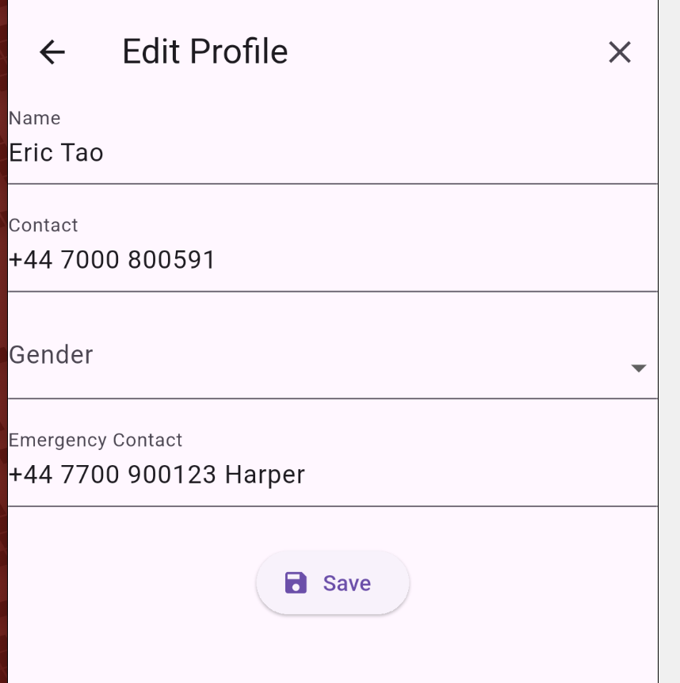

# itcs424_assignment_6588070

Implementation of Individual Assignment for ITCS424

## Student Information
Name: Nakarin Phoorahong

Student ID: 6588070

Section: 2

So, I implemented 3 main different pages called patient' profile page  
with the edit page (allowing patient to edit their information) and appointment page which allow patient to see their past and upcoming pages.

## Pages Implemented
### Page Name:
Patient's Profile page

### **Description:**
In this page, patient can see there profile and edit their profile.

========================
======================== 

### Page Name:
Edit Profile Page

### **Description**:
This page allow user to edit their own information 

========================
======================== 
### **Page Name:**
Appointment Page

### **Description**
In this page, patient can see their upcoming and past appointment which 
tell the date and time, and doctor details.

## Features and Widgets Used
- Scaffold, ListView, TabbarView, mainAxis and CrossAxis, Card, Padding, InkWell, Divider(), Icon, Align, Row, Column, TextSpan, Text.rich(),
TextEditingController, SingleChildScrollView, TextFormField, DropdownButtonFormField

## Known Issues or Limitations
- No technical limitation, One not technical limitation that is the Laziness after a big semester just ended.

## Reflection
1. What did you find most challenging about this project?

**ANSWER**:  Idea and cretivity to form a what output should looklike

2. Which widgets or design elements are you most proud of using?

**ANSWER**:  The Appointment Page because it take a while to create and the utilizing of TabBar is made it look good.

3. What would you add or improve with more time?

**ANSWER**: Everything since it can be better in every way. Nicer UI/UX, More more modern look.